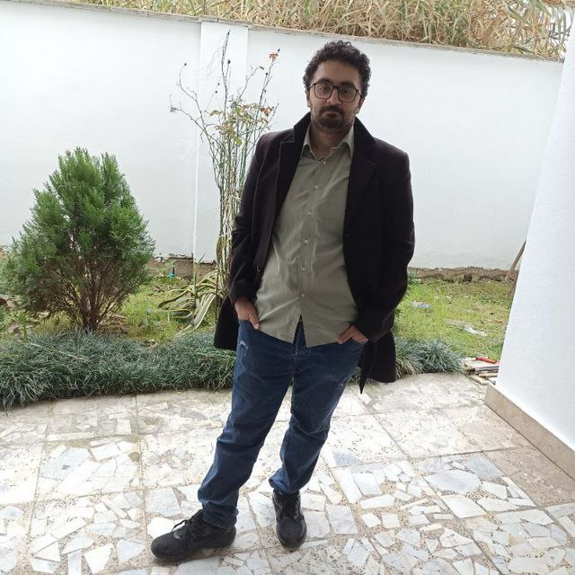
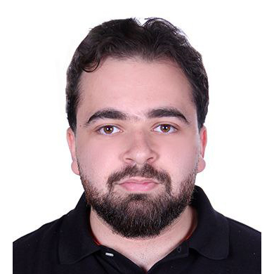
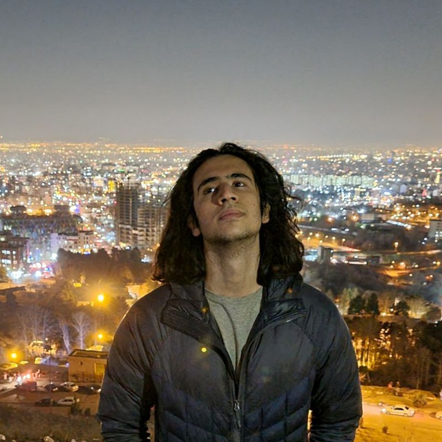
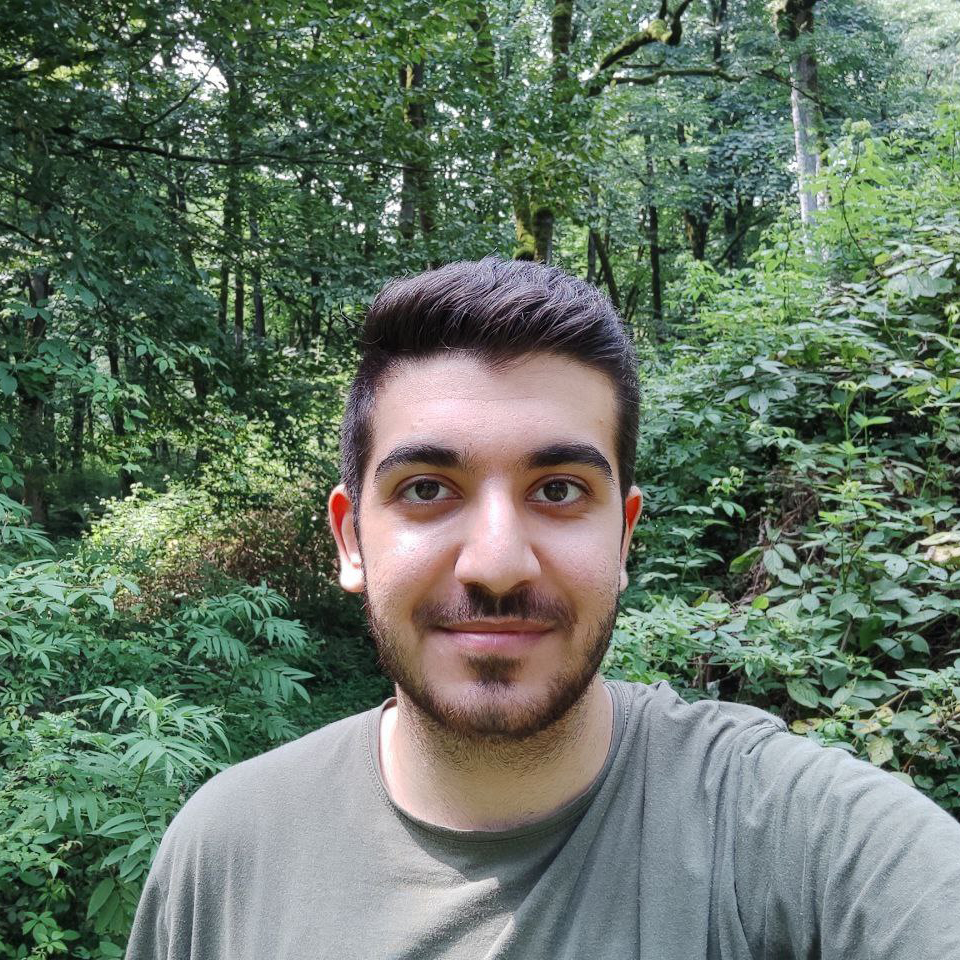

# Welcome

Welcome to Spring 2025 offering of Deep Learning course at Sharif University of Technology! We are excited to have you join us on this journey into the world of deep learning.

## Course Description

This course provides an in-depth introduction to the field of deep learning. Initially, we will explore deep learning conceptually and practically to help you grasp the fundamental concepts. 

## Learning Objectives

- Understand the fundamentals of deep learning
- Apply deep learning to various domains
- Master the concepts and gain practical understanding of DL
- Gain hands-on experience with important DL problems
- Equip students with enough theoretical knowledge to understand research papers

## Instructor

-   {align=left width="150"}
    
        
**Dr. Fatemeh Seyyed Salehi**

        
Instructor

        
[seyyedsalehi@sharif.edu](mailto:seyyedsalehi@sharif.edu)

        

        [:fontawesome-brands-google-scholar:](https://www.researchgate.net/profile/Fatemeh-Seyyedsalehi){:target="_blank"}
        [:fontawesome-brands-linkedin-in:](https://www.linkedin.com/in/fatemeh-seyyedsalehi-586928155){:target="_blank"}
        

    

[//]: # (## Guests)

[//]: # ()
[//]: # (
)

[//]: # (  
)

[//]: # (    )

[//]: # (    
)

[//]: # (        <a href="/guests/sample_guest">Guest name)

[//]: # (    
)

[//]: # (    
)

[//]: # (        <a href="https://x.com/" target="_blank"><svg xmlns="http://www.w3.org/2000/svg" viewBox="0 0 512 512"><!--! Font Awesome Free 6.7.1 by @fontawesome - https://fontawesome.com License - https://fontawesome.com/license/free &#40;Icons: CC BY 4.0, Fonts: SIL OFL 1.1, Code: MIT License&#41; Copyright 2024 Fonticons, Inc.--><path d="M389.2 48h70.6L305.6 224.2 487 464H345L233.7 318.6 106.5 464H35.8l164.9-188.5L26.8 48h145.6l100.5 132.9zm-24.8 373.8h39.1L151.1 88h-42z"></path></svg></a>)

[//]: # (        <a href="https://scholar.google.ca/" target="_blank"><svg xmlns="http://www.w3.org/2000/svg" viewBox="0 0 512 512"><!--! Font Awesome Free 6.7.1 by @fontawesome - https://fontawesome.com License - https://fontawesome.com/license/free &#40;Icons: CC BY 4.0, Fonts: SIL OFL 1.1, Code: MIT License&#41; Copyright 2024 Fonticons, Inc.--><path d="M390.9 298.5s0 .1.1.1c9.2 19.4 14.4 41.1 14.4 64C405.3 445.1 338.5 512 256 512s-149.3-66.9-149.3-149.3c0-22.9 5.2-44.6 14.4-64 1.7-3.6 3.6-7.2 5.6-10.7q6.6-11.4 15-21.3c27.4-32.6 68.5-53.3 114.4-53.3 33.6 0 64.6 11.1 89.6 29.9 9.1 6.9 17.4 14.7 24.8 23.5 5.6 6.6 10.6 13.8 15 21.3 2 3.4 3.8 7 5.5 10.5zm26.4-18.8c-30.1-58.4-91-98.4-161.3-98.4s-131.2 40-161.3 98.4L0 202.7 256 0l256 202.7-94.7 77.1z"></path></svg></a>)

[//]: # (        <a href="http://incompleteideas.net" target="_blank"><svg xmlns="http://www.w3.org/2000/svg" viewBox="0 0 24 24"><path d="M16.36 14c.08-.66.14-1.32.14-2s-.06-1.34-.14-2h3.38c.16.64.26 1.31.26 2s-.1 1.36-.26 2m-5.15 5.56c.6-1.11 1.06-2.31 1.38-3.56h2.95a8.03 8.03 0 0 1-4.33 3.56M14.34 14H9.66c-.1-.66-.16-1.32-.16-2s.06-1.35.16-2h4.68c.09.65.16 1.32.16 2s-.07 1.34-.16 2M12 19.96c-.83-1.2-1.5-2.53-1.91-3.96h3.82c-.41 1.43-1.08 2.76-1.91 3.96M8 8H5.08A7.92 7.92 0 0 1 9.4 4.44C8.8 5.55 8.35 6.75 8 8m-2.92 8H8c.35 1.25.8 2.45 1.4 3.56A8 8 0 0 1 5.08 16m-.82-2C4.1 13.36 4 12.69 4 12s.1-1.36.26-2h3.38c-.08.66-.14 1.32-.14 2s.06 1.34.14 2M12 4.03c.83 1.2 1.5 2.54 1.91 3.97h-3.82c.41-1.43 1.08-2.77 1.91-3.97M18.92 8h-2.95a15.7 15.7 0 0 0-1.38-3.56c1.84.63 3.37 1.9 4.33 3.56M12 2C6.47 2 2 6.5 2 12a10 10 0 0 0 10 10 10 10 0 0 0 10-10A10 10 0 0 0 12 2"></path></svg></a>)

[//]: # (    
)

[//]: # (  
)

[//]: # (  )
[//]: # (  )
[//]: # (
)

## Tentative Schedule

### Lectures

| 
Lecture #
 | 
Topic of the Week
                                        |                  
Lecture
                  | 
Homework
 |
|:-----------------------------------------:|:-----------------------------------------------------------------------------------------|:-------------------------------------------------------------------------:|:----------------------------------------:|
|                 Lecture 1                 | Introduction                                                                             |   
۲۷ بهمن 
   |                                          | 
|                 Lecture 2                 | Deep Neural Networks                                                                     |   
۲۹ بهمن 
   |                                          | 
|                 Lecture 3                 | Backpropagation                                                                          |   
۴ اسفند 
   |                                          |
|                 Lecture 4                 | Optimization                                                                             |   
۶ اسفند 
   |                                          |
|                 Lecture 5                 | Optimization                                                                             |  
۱۱ اسفند 
   |                                          |
|                 Lecture 6                 | Issues on Trining Deep Networks                                                          |  
۱۳ اسفند 
   |                                          |
|                 Lecture 7                 | Regularization Techniques                                                                |  
۱۸ اسفند 
   |                                          |
|                 Lecture 8                 | Generalization Theory And Techniques For DL                                              |  
۲۰ اسفند 
   |                   HW 1                   |
|                 Lecture 9                 | Generalization Theory And Techniques For DL                                              |  
۲۵ اسفند 
   |                                          |
|                Lecture 10                 | CNN                                                                                      |  
۲۷ اسفند 
   |                                          |
|                Lecture 11                 | Advanced CNN's Architectures And Applications                                            | 
۱۶ فروردین 
  |                                          |
|                Lecture 12                 | RNN & LSTM                                                                               | 
۱۸ فروردین 
  |                   HW 2                   |
|                Lecture 13                 | RNN & LSTM & Attention                                                                   | 
۲۳ فروردین 
  |                                          |
|                Lecture 14                 | GNN  (Guest lecturer)                                                                    | 
۲۵ فروردین 
  |                                          |
|                Lecture 15                 | GNN  (Guest lecturer)                                                                    | 
۳۰ فروردین 
  |                   HW 3                   |
|                Lecture 16                 | Text Models and Transformers                                                             | 
۱ اردیبهشت 
  |                                          |
|                Lecture 17                 | 
Mid-term exam (Until the end of Advanced CNN's ..)
 | 
۶ اردیبهشت 
  |                                          |
|                Lecture 18                 | Text models and Transformers                                                             | 
۸ اردیبهشت 
  |                                          |
|                Lecture 19                 | LLMs                                                                                     | 
۱۳ اردیبهشت 
 |                                          |
|                Lecture 20                 | LLMs & Issues & Advanced Topics                                                          | 
۱۵ اردیبهشت 
 |                                          |
|                Lecture 21                 | LLMs & Issues & Advanced Topics                                                          | 
۲۰ اردیبهشت 
 |                                          |
|                Lecture 22                 | Self-Supervised Learning                                                                 | 
۲۲ اردیبهشت 
 |                                          |
|                Lecture 23                 | Contrastive Learning & CLIP                                                              | 
۲۷ اردیبهشت 
 |                   HW 4                   |
|                Lecture 24                 | Generative Models                                                                        | 
۲۹ اردیبهشت 
 |                                          |
|                Lecture 25                 | Generative Models                                                                        |   
۳ خرداد 
   |                                          |
|                Lecture 26                 | Deep RL                                                                                  |   
۵ خرداد 
   |                                          |
|                Lecture 27                 | Deep RL                                                                                  |  
۱۰ خرداد 
   |                                          |
|                Lecture 28                 | Deep RL                                                                                  |  
۱۲ خرداد 
   |                   HW 5                   |

### Homeworks

## Release and Deadline Schedule

| 
Homework #
 |                  
Release
                  |                 
Deadline
                  |
|:------------------------------------------:|:-------------------------------------------------------------------------:|:-------------------------------------------------------------------------:|
|                 Homework 1                 |  
۲۰ اسفند 
   | 
۱۰ فروردین 
  |
|                 Homework 2                 | 
۱۶ فروردین 
  | 
۳۱ فروردین 
  |
|                 Homework 3                 | 
۶ اردیبهشت 
  | 
۲۰ اردیبهشت 
 |
|                 Homework 4                 | 
۲۲ اردیبهشت 
 |  
۱۰ خرداد 
   |
|                 Homework 5                 |  
۱۳ خرداد 
   |  
۳۰ خرداد 
   |

## Logistics & Policies 

- **Lectures:** Held on Saturday and Monday from 10:30 to 12:30 in room 217 of the CS department.

- **Slack Days:** You have a total of 15 slack days throughout the course with no penalty for submitting your homework late. For each homework, you can use up to 3 slack days. After 3 days, the solution will be released, and no further submissions will be accepted. Any additional delays beyond the slack days will result in a 10% reduction in the assignment grade for every day of delay. The 3 days for submitting your work for each homework is a hard deadline, and after that, you will receive a 0 grade because we will release the solution to the homework.

- **Workshop Sessions:** Some workshop sessions will be held during the term. These workshops will present practical implementations of the ideas covered in the lectures or needed to complete the homeworks. These sessions will be held online and the recorded sessions will be released.

[//]: # (- **Lecture Summaries and Quizzes:** Summaries of the previous lecture will be released at 8:00 AM on the day of the next lecture. You must participate in a quiz before the start of the lecture at 1:30 PM. Participation in quizzes will earn you 0.75 bonus points.)

- **Support:** You can ask questions on [Telegram Group](https://t.me/+IUKXT9m4Gx41MWRk) or email the course instructor for office hours.

## Grading

The grading for the Deep Learning course is structured as follows:

### Main Components

- **Homeworks:** 7.5 Points
- **Midterm:** 4.5 Points
- **Final:** 6 Points
- **Course Project:** 2 Points + [1 Extra Point]

Total possible points: 20 + 1 = 21

## Head Assistants

-   {align=left width="150"}
    
        
**Reza Tavakoli**

        
Head TA

        
[seyedreza.shiyade@gmail.com](mailto:seyedreza.shiyade@gmail.com)

        

        [:fontawesome-brands-linkedin-in:](https://www.linkedin.com/in/seyedreza-tavakoli-732a39217/){:target="_blank"}
        

    

## Teaching Assistants

-   {align=left width="150"}
    
        
**Mohammad Mohammadi**

        
Teaching Assistant

        
[mohammadm97i@gmail.com](mailto:mohammadm97i@gmail.com)

        

        [:fontawesome-brands-x-twitter:](https://x.com/imohammad97){:target="_blank"}
        [:fontawesome-brands-github:](https://github.com/iMohammad97){:target="_blank"}
        [:fontawesome-brands-linkedin-in:](https://www.linkedin.com/in/mohammadmohammadi97){:target="_blank"}
        

    

-   {align=left width="150"}
    
        
**Ramtin Moslemi**

        
Teaching Assistant

        
[ramtin.moslemi@yahoo.com](mailto:ramtin.moslemi@yahoo.com)

        

        [:fontawesome-brands-google-scholar:](https://scholar.google.com/citations?user=KM1izs0AAAAJ){:target="_blank"}
        [:fontawesome-brands-linkedin-in:](https://www.linkedin.com/in/ramtin-m){:target="_blank"}
        [:material-web:](https://ramtinmoslemi.github.io){:target="_blank"}
        

    

-   {align=left width="150"}
    
        
**Morteza Shahrabi Farahani**

        
Teaching Assistant

        

        [:fontawesome-brands-google-scholar:](https://scholar.google.com/citations?user=luHEE4UAAAAJ&hl=en){:target="_blank"}
        [:fontawesome-brands-linkedin-in:](https://www.linkedin.com/in/morteza-shahrabi-farahani-70b618201/){:target="_blank"}
        [:fontawesome-brands-github:](https://github.com/morteza-shahrabi-farahani){:target="_blank"}
        

    

-   {align=left width="150"}
    
        
**Aren Gol Azizian**

        
Teaching Assistant

        

        [:fontawesome-brands-linkedin-in:](https://www.linkedin.com/in/aren-golazizian-33b3a0152?utm_source=share&utm_campaign=share_via&utm_content=profile&utm_medium=android_app){:target="_blank"}
        

    
-   {align=left width="150"}
    
        
**Shaygan Adim**

        
Teaching Assistant

        

        [:fontawesome-brands-linkedin-in:](https://www.linkedin.com/in/shaygan-adim-7aa394296?utm_source=share&utm_campaign=share_via&utm_content=profile&utm_medium=android_app){:target="_blank"}
        

    
-   {align=left width="150"}
      
          
**Morteza Shahrabi Farahani**

          
Teaching Assistant

        
[m.m.vahedi13800@gmail.com](mailto:m.m.vahedi13800@gmail.com)

          

          [:fontawesome-brands-linkedin-in:](https://www.linkedin.com/in/mmvahedi){:target="_blank"}
          [:fontawesome-brands-github:](https://github.com/MMVahedi){:target="_blank"}
          

      
-   {align=left width="150"}
    
        
**Mohammad Aghaei**

        
Teaching Assistant

        

        [:fontawesome-brands-linkedin-in:](https://www.linkedin.com/in/mohammad--aghaei/){:target="_blank"}
        [:fontawesome-brands-telegram:](https://t.me/mohmmadweb/){:target="_blank"}
        

    
-   {align=left width="150"}
    
        
**Erfan Sobhaei**

        
Teaching Assistant

        

        [:fontawesome-brands-linkedin-in:](https://www.linkedin.com/in/erfansobhaei){:target="_blank"}
        [:fontawesome-brands-github:](https://github.com/erfansobhaei){:target="_blank"}
        

    
-   {align=left width="150"}
    
        
**Ali Alvandi**

        
Teaching Assistant

        

        [:fontawesome-brands-github:](https://github.com/AliAvd){:target="_blank"}
        

    

